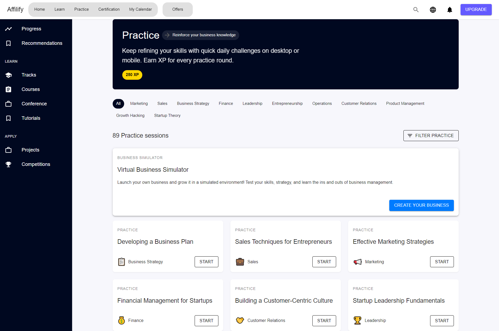
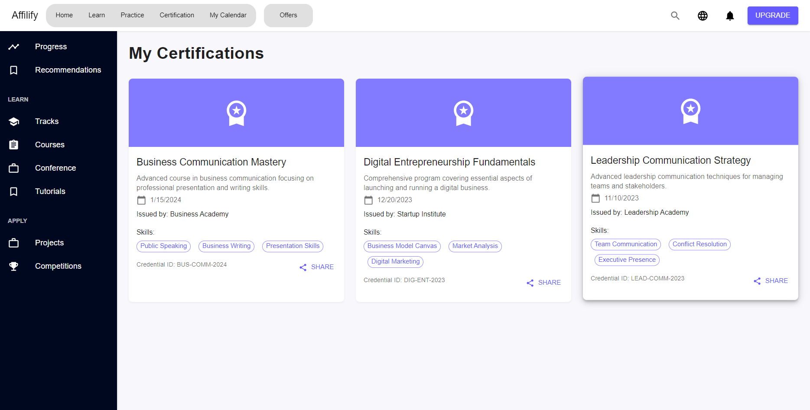
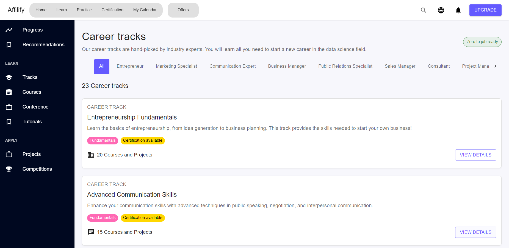
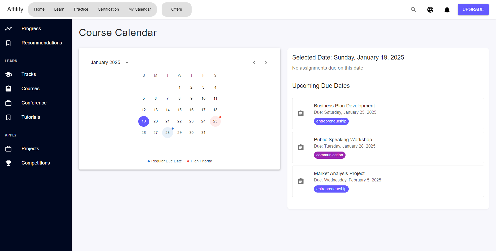
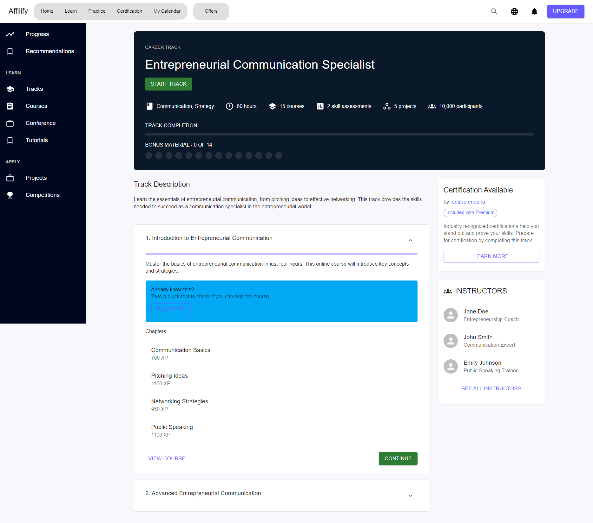
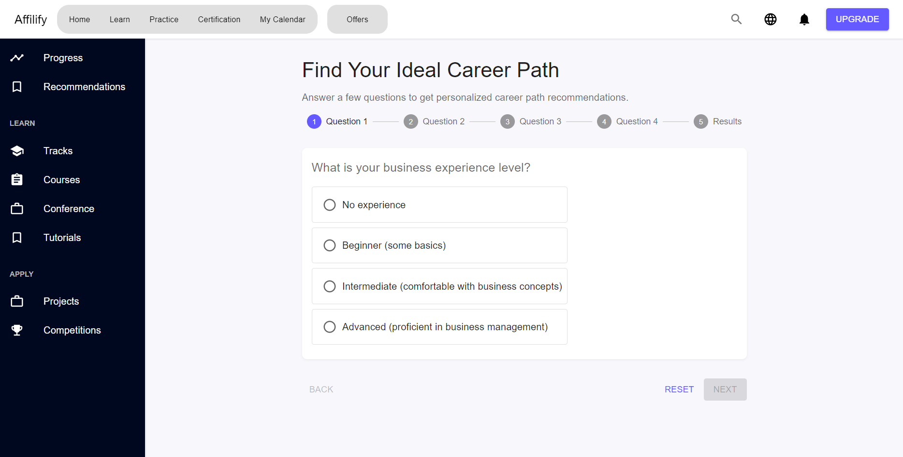
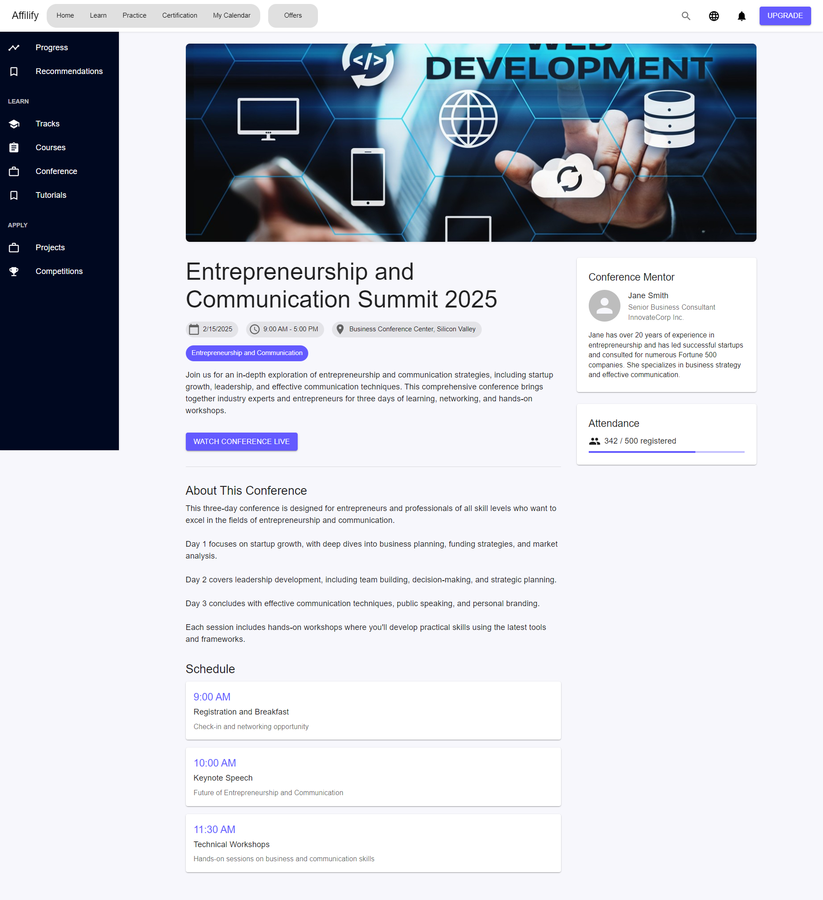
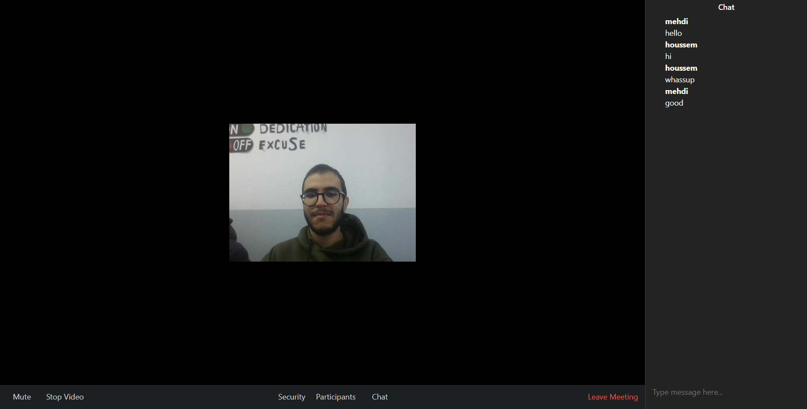
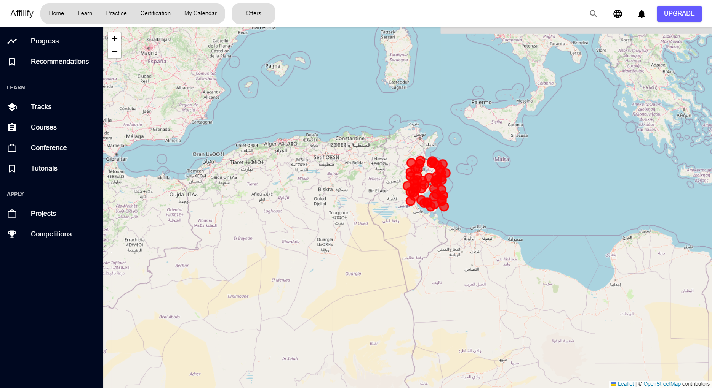

# Affilify

## 1. Project Overview

**Description**: Affilify is a Learning Management System (LMS) designed to empower users with entrepreneurial and communication skills. This platform addresses the challenge of making quality educational resources and interactive tools accessible for personal and professional development. It combines modern technologies like live video streaming and an AI-powered chatbot to deliver an immersive learning experience.

**Inspiration**: The idea behind Affilify emerged from the need to create a platform that bridges the gap in entrepreneurial education by offering tailored tools and features. Our aim is to provide an engaging and accessible learning environment that can help individuals achieve their career aspirations and improve their communication skills.

---

## 2. Features

- **Progress Tracking**: Users can view their progress and learning dashboards.
- **Recommendation System**: Based on user preferences and answers to specific questions, the platform recommends suitable career paths.
- **Course Watching**: Users can watch various courses and tutorials to enhance their knowledge.
- **Video Conferencing**: Participate in virtual conferences with mentors and other participants.
- **Interactive Map**: View all available offers and opportunities on an integrated map.
- **Calendar Management**: Track upcoming deadlines and scheduled events on the platform.
- **AI-Powered Chatbot**: Get instant support and guidance via a built-in chatbot powered by Rasa.

---

## 3. Technology Stack

**Frontend**:

- ReactJS
- Material-UI (MUI)
- Socket.IO

**Backend**:

- ExpressJS
- Socket.IO

**Database**:

- MongoDB

**Additional Tools**:

- Rasa (for chatbot functionality)
- WebRTC (for video streaming)

---

## 4. Installation and Usage

### Prerequisites

Ensure the following are installed on your system:

- Node.js (version 14 or higher)
- MongoDB
- Python (for Rasa)

### Installation Steps

1. Clone the repository:

   ```bash
   git clone https://github.com/FkihMehdi/TuniHack.git
   ```

2. Navigate to the project directory:

   ```bash
   cd TuniHack
   ```

3. Set up the backend:

   To run the backend, you need to have a MongoDB database running on your local machine.

   First you need to create a .env file in the server folder and add the following variables:

   ```bash
   PORT=5000
   MONGO_URI=mongodb://localhost:27017/
   JWT_SECRET=your_secret_key
   ```

   Then open a terminal and run the following commands:

   ```bash
   cd server
   npm install
   npm run start
   ```

4. Set up the frontend:

   ```bash
   cd client
   npm install
   npm start
   ```

5. Set up the video streaming server:

   ```bash
   cd video-streaming-server
   npm install
   npm run start
   ```

6. Set up the chatbot:
   ```bash
   cd chatbot
   pip install rasa
   rasa run
   ```

---

### Usage Instructions

1. Access the application by navigating to `http://localhost:3000` in your browser.
2. Create an account or log in to explore the platform.
3. Use the dashboard to track progress, view recommendations, and access courses.
4. Join live video conferences with mentors or explore offers on the interactive map.

---

## 5. Demo

- **Practice Page**:
  

- **My Certifications**:
  

- **Career Tracks**:
  

- **Upcoming Due Dates**:
  

- **Course Content**:
  

- **Recommandation System**:
  

- **Conference Page**:
  

- **Visio Conference**:
  

- **Available Offers**:
  

---

## 6. Team Members

- **[Sahnoun Houssem]**: Full-Stack Developer
- **[Fkih Mehdi]**: Full-Stack Developer
- **[Mahmoudi Maher]**: Frontend Developer
- **[Hnana Ahmed]**: Frontend Developer

---

## 7. Challenges Faced

- **Integrating Rasa Chatbot**: Configuring and integrating Rasa required extensive training and debugging.
- **Building the Video Streaming Server**: Ensuring smooth and lag-free video streaming for conferences was technically demanding.
- **Creating the Recommendation System**: Designing an algorithm to provide personalized career path suggestions was challenging.

_Solution_: Collaborative problem-solving and iterative testing helped us overcome these hurdles.

---

## 8. Future Improvements

- **Mobile Application**: Develop a mobile version of the platform for enhanced accessibility.
- **Gamification**: Introduce gamified elements like achievements and leaderboards to boost user engagement.
- **AI-Driven Insights**: Implement advanced analytics to provide users with actionable learning insights.

---

## 9. License

MIT License

Copyright (c) 2025 [Fkih Mehdi/DevMasters]

Permission is hereby granted, free of charge, to any person obtaining a copy of this software...

---

## 10. Acknowledgments

- Thanks to the open-source community for tools and frameworks.
- Special thanks to mentors and peers for guidance.
- Inspired by innovative LMS solutions worldwide.
